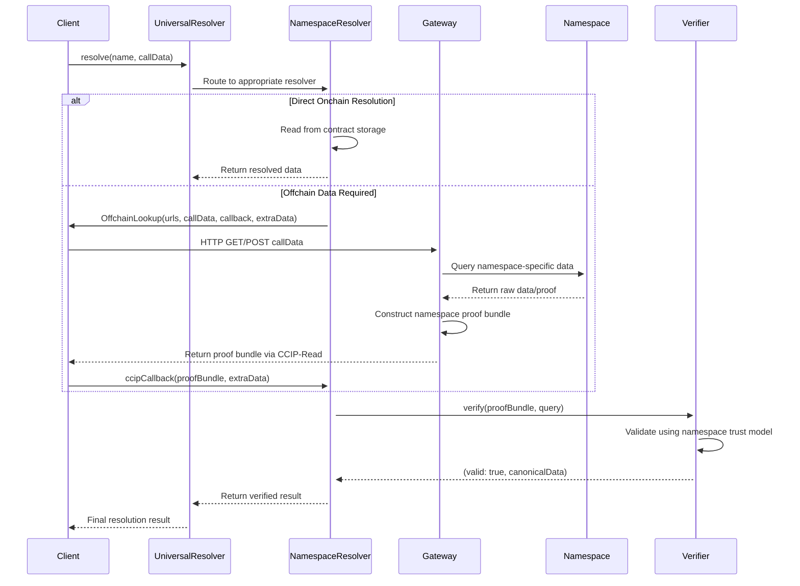

:::warning
**Research Documentation**: This site presents hypothetical implementations and research concepts for the Universal Resolver Matrix framework. Content represents educational explorations and may not reflect current or planned features of Ethereum Name Service (ENS) or related protocols.
:::

## The Universal Resolver Matrix

The **Universal Resolver Matrix (URM)** is a comprehensive framework for implementing universal name resolution across diverse namespaces and ecosystems. It provides a systematic approach to mapping resolution pathways using four core dimensions:

- **Trust Model**,
- **Proof System**,
- **Rules & Lifecycle**, and
- **Verification Path**.

Built on Ethereum Name Service (ENS) infrastructure, the URM creates a unified identity resolution system that bridges traditional DNS, blockchain ecosystems, and modern authentication methods into a single, coherent framework.

## Universal Resolution Framework

The URM implements a consistent **resolution choreography** across all namespaces through a unified four-dimensional framework:

:::note
**Diagram Legend**: The conditional "alt" block shows two resolution strategies — direct onchain resolution for available data vs. CCIP-Read assisted resolution for cross-chain/namespace data fetching.
:::

## Core Resolution Profiles

### [DNSSEC Onchain Resolution](/patterns/dnssec-pattern)

Trustless DNS→ENS resolution via DNSSEC P-256 signatures validated onchain.

### [EVM Resolution](/patterns/evm-pattern)

ENSIP-19 multichain primary names across EVM ecosystems.

### [Non-EVM Resolution](/patterns/non-evm-pattern)

Extends ENSIP-19 to non-EVM blockchains (Cosmos, Solana, etc.)

### [WebAuthn Resolution](/patterns/webauthn-pattern)

Passkey-based ENS name control and authentication. The **agent-authority cell** the URM identified as highest-leverage — productionized in the [Prototype Specification](/spec/).

## Framework Architecture

### Four Core Dimensions

The URM structures each resolution profile around four fundamental dimensions:

1. **Trust Model** — Establishes the cryptographic and organizational trust foundations
2. **Proof System** — Defines how proofs are generated, validated, and verified
3. **Rules & Lifecycle** — Governs the creation, management, and expiration of names
4. **Verification Path** — Maps the complete resolution pathway from query to result

### Technical Specifications

Each profile provides comprehensive technical references including:
- Contract & namespace inventory
- Deployment architecture considerations
- Edge cases and client requirements
- Implementation details and best practices

## Technical Resources

### [ENSIP Specifications](https://docs.ens.domains/ensip/)

Official ENS Improvement Proposals and technical standards.

### [EIP-7951: P-256 Precompile](https://eips.ethereum.org/EIPS/eip-7951)

Ethereum precompile for P-256 elliptic curve operations.

### [ENSIP-19: Multichain Names](https://docs.ens.domains/ensip/19)

Primary name resolution across multiple blockchains.

### [DNSSEC Algorithm 13](https://www.rfc-editor.org/rfc/rfc6605.html)

P-256 ECDSA signatures for DNSSEC validation.
