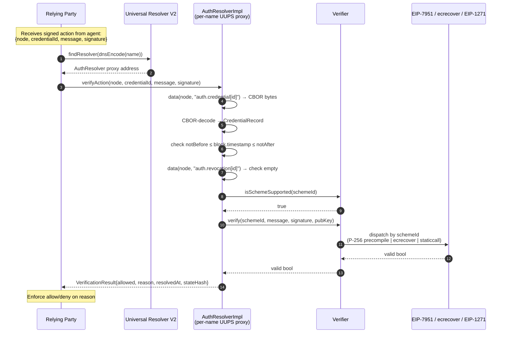

# 7. End-to-End Verification Flow

The flow generalizes across all three v1 schemes. The dispatch step (P) varies by `schemeId` on the resolved credential; the rest of the orchestration is identical. The Verifier is a single shared contract; the AuthResolver is per-name.
