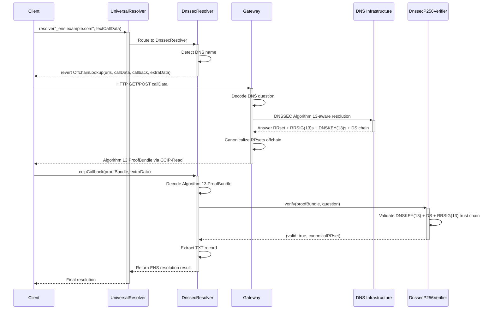

:::info
**Working Implementation**: This document describes three complementary DNSSEC P-256 demonstration projects deployed on Sepolia, all leveraging the EIP-7951 P-256 precompile. Working implementations are available in the [`dnssec-solutions`](https://github.com/steg-eth/dnssec-solutions) repository.
:::

## 1. Introduction

### 1.1. Document Purpose

This document provides a comprehensive technical reference for implementing DNSSEC P-256 (Algorithm 13) as a profile in the Universal Resolver Matrix (URM), serving as a technical specification for DNSSEC onchain resolution.

### 1.2. Demonstration Projects

This specification is supported by three demonstration projects in the [`dnssec-solutions`](https://github.com/steg-eth/dnssec-solutions) repository that showcase different approaches to DNSSEC verification:

1. **Gasless DNSSEC Resolution** - CCIP-Read (EIP-3668) implementation with Profile A trust model (pinned zone KSK)
2. **Onchain DNS Import** - ENS-style DNSSEC oracle with Profile B trust model (IANA root DS chain)
3. **DNS Claiming** - ENS registrar contracts for claiming DNS names using DNSSEC proofs

All three projects leverage the **EIP-7951 P-256 precompile** for efficient Algorithm 13 signature verification, achieving ~94% gas savings compared to Solidity implementations.

### 1.3. Universal Resolver Matrix Framework

The Universal Resolver Matrix (URM) is a systematic framework for mapping resolution pathways across namespaces using four core dimensions:

1. **Trust Model**,
2. **Proof System**,
3. **Rules & Lifecycle**, and
4. **Verification Path**.

This document structures DNSSEC P-256 implementation around these dimensions, with additional sections covering:

- Deployment Architecture (L1 vs Namechain considerations)
- Contract & Namespace Inventory
- URM Mapping (Resolver Profiles)
- Edge Cases & Client Requirements

## 2. Scope & Goals

### 2.1. DNSSEC Algorithm 13 (P-256) Overview

ENS uses **Algorithm 13 (ECDSAP256SHA256)** for DNSSEC verification, enabling trustless DNS-to-ENS resolution by validating P-256 ECDSA signatures onchain. A DNS record set (RRset) is considered verifiable if its RRSIG uses Algorithm 13 and the signature can be cryptographically chained—via DNSKEY and DS records—up to a trust anchor.

This validation relies on Ethereum's P-256 precompile (EIP-7951) available on both L1 and Namechain for efficient onchain signature verification.

#### Trust Model Choices: Profile A vs Profile B

We provide implementations for both trust models:

**Profile A (Pinned Zone KSK)** - Used by **Gasless DNSSEC Resolution**:
- **Trust Anchor**: Pinned zone KSK (e.g., `eketc.co` KSK with keyTag=2371)
- **Validation**: Verifies domain DNSKEY → TXT record chain only
- **Advantages**: Faster verification, immediate deployment, no dependency on root/TLD Algorithm 13 adoption
- **Limitation**: Does not verify parent zone chain (e.g., `.co` → root)
- **Use Case**: Proof-of-concept, gasless resolution via CCIP-Read

**Profile B (IANA Root DS Chain)** - Used by **Onchain DNS Import** and **DNS Claiming**:
- **Trust Anchor**: IANA root zone DNSKEY records
- **Validation**: Full DS (Delegation Signer) chain from root → TLD → domain
- **Advantages**: Complete trust chain validation, ENS-compatible, maximum security
- **Requirements**: Root/TLD zones must use Algorithm 13 or hybrid verification approaches
- **Use Case**: Full on-chain oracle, ENS registrar integration

**Why Both Models:**
1. **DNS root zone uses RSA (Algorithm 8)**, not ECDSA-P256 (Algorithm 13)
2. **Most TLDs use RSA**, not Algorithm 13 (only `.fr` is known to use Algorithm 13)
3. **Profile A** demonstrates immediate Algorithm 13 verification without waiting for infrastructure adoption
4. **Profile B** provides complete ENS-compatible verification once Algorithm 13 adoption increases

**Implementation Status:**
- **Profile A**: `Gasless DNSSEC Resolution/` - Sepolia testnet, working with `eketc.co`
- **Profile B**: `Onchain DNS Import/` - Full oracle implementation with IANA root support

### 2.3. DNS Record Types & Usage

DNSSEC P-256 supports verification of all standard DNS record types (TXT, A, AAAA, CNAME, etc.), with primary focus on:

- **TXT records** for ENS attribution (`_ens.example.com TXT "ens_name=example.eth"`)
- **A/AAAA records** for direct IP address resolution
- **CNAME records** for DNS aliasing with DNSSEC chain following

### 2.4. Deployment Architecture: L1 vs Namechain

DNSSEC P-256 verification requires both P-256 precompile and SHA-256 hashing. The deployment location significantly impacts gas costs and production viability:

#### 2.4.1. Architecture Overview

Three distinct architectures are demonstrated, each with different deployment patterns:

**1. Gasless DNSSEC Resolution (Profile A - CCIP-Read)**
- **Resolver Contract**: Deploys on L1 or Namechain
- **Gateway Server**: Off-chain Node.js server for proof fetching
- **Trust Anchor**: Pinned zone KSK stored in resolver contract
- **Gas Model**: Users pay no gas; gateway pays for verification

**2. Onchain DNS Import (Profile B - Oracle)**
- **Oracle Contract**: Deploys on L1 or Namechain (recommended: Namechain)
- **Trust Anchors**: IANA root zone DNSKEY records stored in oracle
- **Gas Model**: Users submit proofs and pay gas for verification
- **Storage**: Verified DNS records stored on-chain permanently

**3. DNS Claiming (Profile B - Registrar)**
- **Registrar Contract**: Deploys on L1 or Namechain
- **Dependency**: Uses Onchain DNS Import's oracle for verification
- **Integration**: Claims DNS names on ENS registry
- **Gas Model**: Users pay gas for claiming operations

:::note
**Deployment Recommendation**: For Profile B implementations, **Namechain deployment is strongly recommended** to avoid expensive cross-chain calls. This enables seamless L2-to-L2 verification flows without L1 bridging overhead, achieving 98-99% gas cost reduction.
:::

#### 2.4.2. Sepolia Testnet Deployments

**Profile A Implementation (Gasless DNSSEC Resolution):**

| Contract | Address | Purpose |
|----------|---------|---------|
| **DnssecP256Verifier** | `0x580F2Db4Da8E6D5c654aa604182D0dFD17D5766B` | Trust anchor storage (pinned KSK) and DNSSEC verification |
| **DnssecResolver** | `0x7233d88AF9ee1eC3833F6AF4f733c1C5c0587Da2` | CCIP-Read resolver for DNSSEC-backed names |

**Working Example:**
- DNS Name: `_ens.eketc.co` (TXT record: `"ens_name=dnssec.eth"`)
- ENS Name: `dnssec.eth` (Sepolia)
- Trust Anchor: `eketc.co` KSK (keyTag=2371, Algorithm 13) - Profile A pinned anchor
- Gateway: `https://gateway.eketc.co/ccip-read`

**Profile B Implementation (Onchain DNS Import):**

| Contract | Purpose |
|----------|---------|
| **DNSSECOracle** | Full IANA root DS chain verification oracle |
| **Algorithm Contracts** | P-256 (EIP-7951) and RSA signature verification |

**Note**: Profile B deployments are demonstrated in the `Onchain DNS Import/` project. See project README for deployment addresses and examples.

**EIP-7951 Precompile**: Confirmed available at `0x0100` on Sepolia

#### 2.4.3. Contract Inventory

Three distinct contract patterns are demonstrated:

**Pattern 1: CCIP-Read Resolver (Profile A - Gasless DNSSEC Resolution)**
- **DnssecP256Verifier** - Trust anchor holder (pinned KSK) and cryptographic verifier using P-256 precompile
- **DnssecResolver** - CCIP-Read resolver for DNSSEC-backed DNS names with offchain proof fetching
- **Gateway Server** - Off-chain Node.js server that fetches DNSSEC proofs and serves via CCIP-Read

**Pattern 2: Oracle-Based (Profile B - Onchain DNS Import)**
- **DNSSECOracle** - Full DNSSEC oracle with IANA root trust anchors, stores verified DNS records on-chain
- **Algorithm Contracts** - P-256 (EIP-7951 precompile) and RSA signature verification implementations
- **No Gateway Required** - Users submit proofs directly to oracle contract

**Pattern 3: Registrar-Based (Profile B - DNS Claiming)**
- **DNSRegistrar** - ENS registrar for claiming DNS names using DNSSEC proofs
- **DNSClaimChecker** - Library for parsing `_ens` TXT records to extract owner addresses
- **Dependency**: Uses Onchain DNS Import's DNSSECOracle for proof verification

**Common Infrastructure:**
- **Universal Resolver (L1/L2)** - Existing resolution entry point (optional but recommended)
- **EIP-7951 P-256 Precompile** - Shared cryptographic primitive at `0x0100` for all patterns

#### 2.4.4. Roots of Trust & Security

The canonical root of trust consists of:
- **DNS Root Zone KSK** - Stored in DnssecP256Verifier contract as trust anchors
- **DNSSEC Chain of Trust** - Hierarchical validation from root → TLD → SLD → zone
- **Ethereum Consensus** - Onchain verification guarantees

Security is inherited from DNSSEC's cryptographic signatures and Ethereum consensus. DNS records are valid only if the complete DNSSEC chain validates onchain.

#### 2.4.5. Benefits & Tradeoffs

This architecture enables:
- **Trustlessness**: Cryptographic proof of DNS record authenticity
- **Cost-effectiveness**: Namechain deployment reduces gas costs by 98-99%
- **Scalability**: SHA-256 hashing and P-256 verification optimized for onchain execution
- **DNSSEC Integration**: DNS zones become first-class ENS resolution sources

#### 2.4.6. Governance Requirements

While not strictly required for basic resolver operation, a production-ready DNSSEC resolver should go through ENS DAO governance for integration into core ENS infrastructure. DAO approval is required if you want your resolver to be:

- Set as the default resolver for ENS (e.g., for the reverse registrar or for .eth names)
- Integrated at the protocol level (e.g., replacing the public resolver, or being referenced in official ENS contracts)

**Why Governance Matters:**

DAO approval is a matter of governance and trust. If you want your resolver to be widely used, trusted, or set as a default in ENS infrastructure, DAO approval:
- Signals community trust and security review
- Ensures the resolver is maintained and meets ENS standards
- Protects against unauthorized trust anchor modifications during DNS root key rollovers

## 3. Trust Model

### 3.1. Roots of Trust

DNSSEC P-256 supports two trust model approaches:

**Profile A (Pinned Zone KSK)** - Used by Gasless DNSSEC Resolution:
- **Trust Anchor**: Pinned zone-level KSK stored in the verifier contract
- **Example**: `eketc.co` KSK (keyTag=2371, Algorithm 13) serves as the trust anchor
- **Why stored in contract?** Solves the "bootstrap problem" - establishes a fixed trust anchor without requiring root zone verification
- **Advantage**: Immediate deployment without dependency on root/TLD Algorithm 13 adoption

**Profile B (IANA Root DS Chain)** - Used by Onchain DNS Import and DNS Claiming:
- **Trust Anchor**: IANA root zone Key Signing Key (KSK) stored in the oracle contract
- **Chain Validation**: Complete DS chain from root → TLD → SLD → zone
- **Why stored in contract?** Solves the "bootstrap problem" - to verify DNSSEC, we need root keys, but fetching them requires verification (infinite regress). Onchain storage establishes a fixed trust anchor.
- **Advantage**: Complete trust chain validation, ENS-compatible approach

### 3.2. DNSSEC Chain of Trust

Trust flows hierarchically from the DNS root zone down to individual records:
1. **Root Zone** (`.`) - Contains root DNSKEY, signs TLD DS records
2. **TLD Zone** (`com`) - Contains TLD DNSKEY, signs SLD DS records
3. **SLD Zone** (`example.com`) - Contains zone DNSKEY, signs resource records
4. **Resource Records** - Individual DNS records signed by zone DNSKEY

Each level validates the next via DS (Delegation Signer) records containing cryptographic digests of child zone DNSKEYs.

### 3.3. Security Guarantees

**Security properties:**
- **Cryptographic authenticity** - DNS records signed by zone operators with P-256 ECDSA
- **Integrity protection** - Records cannot be tampered without breaking signatures
- **Non-repudiation** - Zone operators cannot deny signing their records
- **Trust minimization** - Security depends only on DNS root KSK and Ethereum consensus

**Attacks protected against:**
- **DNS spoofing** - Invalid signatures rejected onchain
- **Man-in-the-middle** - Signatures prevent tampering
- **Gateway manipulation** - Invalid proofs rejected by verifier
- **Record tampering** - Any modification breaks signature verification

**Cryptographic assumptions:**
- **P-256 ECDSA security** - Hard computational problems
- **SHA-256 collision resistance** - No collisions computationally feasible
- **DNS root KSK integrity** - Root keys authentic and not compromised
- **P-256 precompile correctness** - Precompile implements ECDSA correctly
- **Ethereum consensus** - L1 consensus guarantees verification correctness

## 4. Proof System

### 4.1. Inputs & Core Definitions

**Key inputs for DNSSEC verification:**

- **DNS Question** - `qname (bytes), qtype (uint16)` - The original DNS query that needs verification. Specifies exactly what domain (`qname`) and record type (`qtype`) we're proving is authentic. Example: `"_ens.example.com"` with `qtype = 16` (TXT) to verify ENS attribution records.
- **ProofBundle** - Complete DNSSEC proof chain delivered via CCIP-Read containing all cryptographic evidence: answer RRsets, RRSIG signatures, DNSKEY records, DS delegation proofs, and validity timestamps. This bundle provides everything needed for onchain verification without requiring the contract to fetch additional data.
- **Root Trust Anchors** - Pre-stored DNSKEY records in the verifier contract that serve as the "root of trust" for DNSSEC verification. For ENS Algorithm 13 verification, these are TLD-level anchors (like .fr) rather than root zone keys, since the root currently uses RSA.

**Core data structures:**
- **RR (Resource Record)** - `name, rrtype, rrclass, ttl, rdata` - Individual DNS records containing the actual data. The `name` field specifies the domain, `rrtype` indicates the record type (1=A, 16=TXT, 28=AAAA), `ttl` specifies cache lifetime, and `rdata` contains the actual record content (e.g., IP address, text data).
- **RRSIG (Resource Record Signature)** - `typeCovered, algorithm, labels, originalTTL, expiration, inception, keyTag, signerName, signature` - Cryptographic signature covering a set of DNS records (RRset). For ENS, `algorithm` must be 13, `typeCovered` matches the RR type being verified, and `signature` is a 64-byte P-256 ECDSA signature. The `keyTag` identifies which DNSKEY was used to create this signature.
- **DNSKEY** - `flags, protocol, algorithm, publicKey` - Public key records used to verify RRSIG signatures. For Algorithm 13, `algorithm = 13` and `publicKey` contains 64 bytes of P-256 elliptic curve coordinates (32 bytes x + 32 bytes y). Flags distinguish KSK (257) from ZSK (256) keys.
- **DS (Delegation Signer)** - `keyTag, algorithm, digestType, digest` - Cryptographic digests that prove delegation from parent to child zones. Parent zones create SHA-256 digests of child DNSKEY records and sign them, creating an unbroken chain of trust. For Algorithm 13, `algorithm = 13` and `digestType = 2` (SHA-256).

**Algorithm constants:**
- `ALGORITHM_13 = 13` - ECDSAP256SHA256 - The exclusive elliptic curve algorithm used by ENS for DNSSEC verification. Uses P-256 curve with SHA-256 hashing, providing 128-bit security level. Required for all DNSKEY, DS, and RRSIG records in ENS-verified zones.
- `DNS_RECORD_TYPE_TXT = 16` - TXT records used for ENS attribution. Contains human-readable text like `"ens_name=example.eth"` that maps DNS domains to ENS names. TXT records are ideal for this purpose as they're flexible, widely supported, and don't conflict with other DNS uses.

### 4.2. Cryptographic Primitives

#### 4.2.1. ECDSA P-256 (Algorithm 13: ECDSAP256SHA256)

**Purpose:** Exclusive cryptographic signature algorithm used by ENS for DNSSEC verification. DNS zone operators must sign all DNS resource records using Algorithm 13.

**Usage:**
- Zone operators generate P-256 key pairs for DNSSEC signing (private key for signing, public key in DNSKEY records)
- RRSIG(13) records contain P-256 signatures over canonicalized RRsets using SHA-256 hashing
- DNSKEY(13) records contain P-256 public keys (64 bytes: 32-byte x-coordinate + 32-byte y-coordinate)
- DS records contain SHA-256 digests of DNSKEY(13) records to prove delegations

**Verification:** EIP-7951 P-256 precompile at `0x0100` performs ECDSA signature verification on both L1 and Namechain

**Sepolia Deployment Status:** ✅ **CONFIRMED AVAILABLE**
- Precompile Address: `0x0100`
- Gas Cost per Signature: ~3,000 gas
- Full DNSSEC Verification: ~311,588 gas
- Testnet Cost: &lt; $0.01 (at 0.001 gwei)
- Mainnet Cost: ~$9-30 (at 30-100 gwei)

#### 4.2.2. SHA-256

**Purpose:** Hash function for ECDSAP256SHA256 algorithm and DS record digests.

**Usage:**
- RRsets canonicalized then hashed with SHA-256 before signing
- DS records contain SHA-256 digests of DNSKEY records
- Used in chain of trust validation

**Implementation:** Solidity implementation (no native precompile), ~2,000-3,000 gas per hash

#### 4.2.3. DNS Name Canonicalization

**Purpose:** Normalize DNS names to ensure consistent hashing and signature verification across different implementations.

**Algorithm:** [RFC 4034 Section 6.1](https://www.rfc-editor.org/rfc/rfc4034.html#section-6.1) - DNS name canonicalization:
- Convert all labels to lowercase (ASCII A-Z to a-z)
- Decompress any compressed name pointers
- Remove trailing dots from the root zone
- Ensure consistent representation for cryptographic operations

#### 4.2.4. RRset Canonicalization

**Purpose:** Sort and normalize resource records within an RRset to ensure deterministic hashing for signature verification.

**Algorithm:** [RFC 4034 Section 6.2](https://www.rfc-editor.org/rfc/rfc4034.html#section-6.2) - RRset canonical ordering:
- Sort RRsets by RR type, then by RDATA in network (big-endian) byte order
- Ensures identical RRsets always hash to the same value
- Critical for signature verification consistency across DNS implementations

### 4.3. Proof Types (URM Terms)

#### 4.3.1. dnssec_proof(algorithm_13) — DNSSEC Algorithm 13 Signature Chain

**When Used:**
- DNS zones signed exclusively with Algorithm 13 (ECDSA-P256-SHA256)
- DNSKEY records must use algorithm 13
- DS records must reference algorithm 13 keys
- RRSIG records must use algorithm 13 signatures
- Any RRset (TXT, A, AAAA, etc.) covered by valid RRSIG(13) chaining to DNSKEY(13) with valid DS digest

**Proof Mechanism:**
- **Cryptographic proof required** - Complete DNSKEY(13) + DS + RRSIG(13) trust chain via CCIP-Read
- **Trust Source:** DNS root KSK → TLD → SLD → zone DNSKEY(13) chain validated via DS digests and RRSIG(13) signatures
- **Verification:** DnssecP256Verifier validates Algorithm 13 trust chain onchain using P-256 precompile

**Example Flow:**


### 4.4. Proof Formats

:::info
**Research Structure**: This JSON represents a conceptual DNSSEC proof bundle format for educational purposes. Actual ENS DNSSEC implementations may use different data structures optimized for onchain verification.
:::

**DNSSEC Algorithm 13 Proof Bundle:**
```json
{
  "question": { "qname": "bytes", "qtype": "uint16" },
  "answerRRset": "RR[]",
  "canonicalRRsetBytes": "bytes",
  "answerRRSIGs": "RRSIG[]",  // Must use algorithm 13
  "zoneDNSKEYs": "ZoneDNSKEY[]",  // Must specify algorithm 13
  "delegationDS": "DelegationDS[]",  // Must reference algorithm 13 keys
  "timestamps": { "queryTime": "uint256", "validFrom": "uint256", "validUntil": "uint256" }
}
```

**Validation:** DNSKEY(13) + DS + RRSIG(13) trust chain validation with offchain canonicalization for gas optimization. All signatures must use Algorithm 13, all keys must specify algorithm 13.

### 4.5. Algorithms

#### 4.5.1. DNSSEC Signature Verification (Algorithm 13)
- **Input:** canonicalRRsetBytes, RRSIG, DNSKEY
- **Process:** Hash canonical bytes → verify P-256 signature → check validity windows
- **Output:** bool valid

#### 4.5.2. Chain of Trust Validation
- **Input:** ProofBundle, rootAnchors
- **Process:** Validate root DNSKEY → DS chain → DNSKEY RRSIGs → answer RRSIG
- **Output:** (bool valid, bytes canonicalRRset)

### 4.6. Proof Generation & Validation Flow

#### 4.6.1. Gateway Proof Generation
1. **Decode DNS question** from CCIP-Read callData
2. **Fetch DNSSEC chain** from DNS infrastructure
3. **Canonicalize RRsets** offchain (gas optimization)
4. **Build ProofBundle** with canonical bytes

#### 4.6.2. Onchain Validation (DnssecP256Verifier)
1. **Validate root DNSKEY** matches stored trust anchor
2. **Verify DS chain** (root → TLD → SLD → zone)
3. **Verify DNSKEY RRSIGs** using parent zone keys
4. **Verify answer RRSIG** using zone DNSKEY
5. **Check validity windows** and QNAME/QTYPE matching

### 4.7. Comparison to Other Proof Systems

| Aspect | DNSSEC P-256 | EVM State | WebAuthn |
|--------|--------------|-----------|----------|
| **Proof Type** | DNSSEC Signature Chain | Onchain state | Cryptographic signatures |
| **Primitive** | P-256 ECDSA + SHA-256 | EVM state | P-256 ECDSA |
| **Verification** | P-256 precompile + SHA-256 | Consensus | P-256 precompile |
| **Trust Anchor** | DNS Root KSK | Ethereum L1 | FIDO metadata |
| **Proof Format** | DNSSEC ProofBundle | Storage reads | WebAuthn assertion |
| **Gas Cost** | Medium-High (~25k-38k gas) | Low | Low |

**Key Difference:** DNSSEC provides cryptographic proof of DNS record authenticity, while EVM state proofs prove onchain data. DNSSEC requires complete chain validation from root trust anchors.

## 5. Rules & Lifecycle

### 5.1. High-Level Rules for DNSSEC Records

To establish **verified DNS records** for ENS resolution using Algorithm 13:

1. **DNS zone must be DNSSEC-signed exclusively with Algorithm 13 (ECDSA-P256-SHA256)**
   - Zone operators must configure DNSSEC signing with P-256 keys only
   - All DNSKEY records in the trust chain must specify algorithm 13
   - All DS records must reference algorithm 13 keys
   - All RRSIG records must use algorithm 13 signatures

2. **Any RRset is verifiable if its RRSIG uses Algorithm 13 and chains to DNSKEY(13) with valid DS digest**
   - TXT records for ENS attribution: `_ens.example.com TXT "ens_name=example.eth"`
   - RRset must be covered by valid RRSIG(13) signature
   - RRSIG(13) must chain to DNSKEY(13) via valid DS digest
   - Complete DNSKEY(13) + DS + RRSIG(13) trust chain must exist from zone to root

3. **DNSSEC Algorithm 13 proof chain must validate onchain**
   - CCIP-Read fetches proof bundle containing DNSKEY(13), DS, and RRSIG(13) records
   - DnssecP256Verifier validates complete Algorithm 13 trust chain onchain
   - All cryptographic checks must pass using P-256 precompile (EIP-7951)

**Lifecycle operations:**
- **Register:** DNS zone owner creates DNSSEC-signed records. No onchain registration required.
- **Update:** Zone owner updates records or DNSSEC keys. New proof required for resolution.
- **Remove:** Zone owner removes records or disables DNSSEC. Resolution fails verification.
- **Expiry:** RRSIG signatures expire. Zone operators must re-sign before expiry.

### 5.2. Profile A: Algorithm 13-Specific Rules (Gasless DNSSEC Resolution)

- **Algorithm exclusivity:** Only Algorithm 13 (ECDSA-P256-SHA256) supported; all other algorithms rejected
- **DNSKEY requirements:** DNSKEY records must specify algorithm 13 and contain P-256 public keys
- **RRSIG requirements:** RRSIG records must use algorithm 13 and cover RRsets with valid P-256 signatures
- **Signature validity windows:** RRSIG(13) signatures must be valid at verification time (inception ≤ now ≤ expiration)
- **Key rollover handling:** Zone operators can rollover DNSKEY(13) following DNSSEC procedures with proper double-signing
- **Trust anchor:** Pinned zone KSK serves as trust anchor (no DS chain verification required)
- **QNAME/QTYPE matching:** RRSIG(13) must exactly match original DNS question (QNAME and QTYPE)

### 5.3. Profile B: Hybrid Algorithm Rules (Onchain DNS Import / DNS Claiming)

- **Algorithm support:** Both Algorithm 8 (RSA/SHA-256) and Algorithm 13 (ECDSA-P256-SHA256) supported
- **DNSKEY requirements:** DNSKEY records can specify algorithm 8 or 13; P-256 keys for algorithm 13, RSA keys for algorithm 8
- **DS requirements:** DS records must reference supported algorithm keys and use valid digest algorithms (SHA-256 preferred)
- **RRSIG requirements:** RRSIG records can use algorithm 8 or 13; signatures verified accordingly
- **Signature validity windows:** RRSIG signatures must be valid at verification time (inception ≤ now ≤ expiration)
- **Key rollover handling:** Zone operators can rollover DNSKEYs following DNSSEC procedures with proper double-signing
- **Trust chain completeness:** Complete DNSKEY + DS + RRSIG delegation chain required from zone to IANA root trust anchor
- **QNAME/QTYPE matching:** RRSIG must exactly match original DNS question (QNAME and QTYPE)

### 5.3. DNS Record Types

| Record Type | Usage in ENS | Example |
|-------------|--------------|---------|
| **TXT** | Primary for ENS attribution | `_ens.example.com TXT "ens_name=example.eth"` |
| **A** | IPv4 addresses | `example.com A 192.0.2.1` |
| **AAAA** | IPv6 addresses | `example.com AAAA 2001:db8::1` |
| **CNAME** | DNS aliases | `www.example.com CNAME example.com` |

## 6. Verification Path

### 6.1. Generic DNSSEC Verification

Given a DNS name and record type:

**1. Query Phase**
- Client calls UniversalResolver.resolve(dnsName, callData)
- Universal Resolver routes to DnssecResolver
- DnssecResolver triggers OffchainLookup with gateway URL

**2. Proof Phase**
- Client fetches ProofBundle from gateway
- Gateway performs DNSSEC-aware resolution
- Gateway canonicalizes RRsets offchain
- Gateway returns ProofBundle via CCIP-Read

**3. Verification Phase (Profile A Implementation)**
- Client calls DnssecResolver.ccipCallback(proofBundle, extraData)
- Resolver calls DnssecP256Verifier.verify() with Algorithm 13 proof bundle
- Verifier validates pinned zone KSK trust anchor (Algorithm 13)
- Verifier validates KSK → DNSKEY RRset signature (Algorithm 13)
- Verifier validates ZSK → answer RRset signature (Algorithm 13)
- Verifier ensures all signatures use Algorithm 13 and all keys specify algorithm 13
- Resolver extracts DNS record (TXT, A, etc.) and resolves ENS name if applicable
- Returns final ENS resolution result

**Profile A Trust Chain:**
```
Pinned Trust Anchor: eketc.co KSK (keyTag=2371, flags=257)
    ↓ signs
eketc.co DNSKEY RRset (contains KSK + ZSK)
    ↓ contains authenticated ZSK (keyTag=34505, flags=256)
        ↓ signs
_ens.eketc.co TXT RRset
    ↓ resolves to
dnssec.eth (ENS name)
```

### 6.1.1. Complete Verification Flow Example

**The Verification Flow - How All Components Work Together:**

1. **Start with DNS Question:** `"_ens.example.com TXT"` (qname + qtype = 16)
2. **Get ProofBundle:** Contains RRsets, RRSIGs, DNSKEYs, DS records from gateway
3. **Check RRSIG:** Verify the TXT RRset is signed with Algorithm 13 (algorithm field = 13)
4. **Find DNSKEY:** Use RRSIG keyTag to locate the DNSKEY(13) that signed it
5. **Verify signature:** Use P-256 precompile to check the 64-byte ECDSA signature
6. **Check chain:** Follow DS records up to trusted TLD anchor (like .fr)
7. **Validate timestamps:** Ensure RRSIG inception ≤ now ≤ expiration
8. **Extract data:** Get verified TXT record content for ENS resolution

**Example with eketc.co Working Implementation:**
- **DNS Question:** `"_ens.eketc.co TXT"` (verifying ENS attribution)
- **RRSIG Check:** Algorithm 13 signature covering TXT RRset (signed by ZSK)
- **DNSKEY Match:** keyTag=34505 points to eketc.co ZSK with P-256 coordinates
- **Trust Chain:** KSK (keyTag=2371) → DNSKEY RRset → ZSK (keyTag=34505) → TXT RRset
- **Final Result:** Cryptographically verified `"ens_name=dnssec.eth"`

This creates a complete chain of cryptographic trust from individual DNS records through the DNSKEY(13) + DS + RRSIG(13) trust chain up to TLD-level anchors!

### 6.2. Resolver / Gateway Topology

**Gateway Responsibilities (Profile A - Gasless DNSSEC Resolution):**
- Fetch DNSSEC Algorithm 13 records from DNS infrastructure (DNSKEY(13), RRSIG(13))
- **Canonicalize RRsets offchain** using RFC 4034 Section 6.1 (DNS name canonicalization) and Section 6.2 (RRset canonical ordering) for gas optimization
- Build ProofBundle with zone DNSKEY(13) chain (pinned KSK trust anchor)
- Ensure all signatures use Algorithm 13 and all keys specify algorithm 13
- Return proof bundles via CCIP-Read

**Verifier Responsibilities (Profile A - Gasless DNSSEC Resolution):**
- Validate pinned zone KSK matches stored trust anchor (Algorithm 13)
- Verify KSK → DNSKEY RRset signature (Algorithm 13)
- Verify ZSK → answer RRset signature (Algorithm 13)
- Validate RRSIG(13) signatures using P-256 precompile (EIP-7951)
- Check Algorithm 13 signature validity windows and QNAME/QTYPE matching
- Reject any non-Algorithm 13 signatures or keys

**Oracle Responsibilities (Profile B - Onchain DNS Import):**
- Validate IANA root zone DNSKEY matches stored trust anchors (Algorithm 8 or 13)
- Verify complete DNSKEY + DS + RRSIG delegation chain from root → TLD → SLD → zone
- Validate DS digests match DNSKEY records at each level
- Validate RRSIG signatures using P-256 precompile (EIP-7951) for Algorithm 13 or RSA verification for Algorithm 8
- Store verified DNS records on-chain permanently
- Support both Algorithm 8 (RSA) and Algorithm 13 (P-256) verification

**Registrar Responsibilities (Profile B - DNS Claiming):**
- Accept DNSSEC proofs for DNS name claiming
- Call Onchain DNS Import's DNSSECOracle for proof verification
- Parse `_ens.<domain>` TXT records to extract owner address
- Claim DNS names on ENS registry via setSubnodeOwner()
- Set default resolver and address records

**Resolver Responsibilities (Profile A - Gasless DNSSEC Resolution):**
- Detect DNS names requiring offchain resolution
- Trigger CCIP-Read via OffchainLookup
- Receive proof bundles and call verifier
- Extract DNS records and resolve ENS names internally
- Return final resolution results

### 6.3. Minimal Client-Side Pseudocode

```typescript
async function verifyDnssecRecord(
  dnsName: string,
  recordType: string,
  universalResolver: Contract
): Promise<VerifiedRecord | null> {
  try {
    const result = await universalResolver.resolve(encodeDNSName(dnsName), encodeResolverCall(recordType));
    return { valid: true, ensRecord: result };
  } catch (error) {
    if (!isOffchainLookupError(error)) throw error;
    
    const lookup: OffchainLookupError = parseOffchainLookupError(error);
    const proofBundle: ProofBundle = await fetchProofBundle(lookup.urls[0], lookup.callData);
    const result = await dnssecResolver.ccipCallback(encodeProofBundle(proofBundle), lookup.extraData);
    return decodeResult(result);
  }
}
```

### 6.4. Example Implementation Flow

**Scenario:** Resolving `_ens.example.com` TXT record using DNSSEC Algorithm 13 to obtain ENS name mapping.

**Steps:**
1. Client initiates resolution → UniversalResolver routes to DnssecResolver
2. DnssecResolver triggers OffchainLookup → Client fetches Algorithm 13 proof from gateway
3. Gateway returns ProofBundle with DNSKEY(13) + DS + RRSIG(13) trust chain → Client calls ccipCallback
4. DnssecP256Verifier validates Algorithm 13 trust chain using P-256 precompile → Resolver extracts TXT record
5. Resolver resolves `example.eth` internally → Returns Ethereum address

## 7. Contract & Namespace Inventory

### 7.1. Core Constants & Helpers

- `ALGORITHM_13 = 13` - ECDSAP256SHA256 - The exclusive elliptic curve algorithm used by ENS for DNSSEC verification
- `P256_PRECOMPILE_ADDRESS = 0x0100` - EIP-7951 precompile address for P-256 ECDSA verification
- `DNS_RECORD_TYPE_TXT = 16` - TXT records used for ENS attribution

### 7.2. DNS Namespaces

| Zone Level | Example | Notes |
|------------|---------|-------|
| **Root** | `.` | DNS root zone, trust anchor |
| **TLD** | `.com` | Top-level domain delegations |
| **SLD** | `example.com` | Second-level domain (zone) |
| **ENS subdomain** | `_ens.example.com` | DNS subdomain for ENS attribution |

### 7.3. Resolver Types

#### 7.3.1. DnssecResolver (Extended Resolver)

Wildcard resolver implementing EIP-3668 (CCIP-Read) for DNSSEC-backed DNS names. Handles offchain lookup triggers, receives proof bundles, calls verifier for validation, and translates DNS records into ENS resolution results. Compatible with ENSIP-10 extended resolver interface patterns.

#### 7.3.2. DnssecP256Verifier (Trust Anchor Holder)

Cryptographic verifier for DNSSEC P-256 proofs. Holds DNS root zone KSK trust anchors, validates complete DNSSEC chain of trust from root to answer records, and verifies RRSIG signatures using P-256 precompile.

### 7.4. Implementation Requirements

Three distinct implementation patterns are demonstrated, each with different contract requirements:

#### 7.4.1. Pattern 1: CCIP-Read Resolver (Profile A - Gasless DNSSEC Resolution)

**Implementation Components:**
1. **UniversalResolver** - Existing ENS infrastructure (no deployment needed)
2. **DnssecP256Verifier** - Holds pinned zone KSK trust anchors, performs P-256 verification
3. **DnssecResolver** - CCIP-Read enabled resolver for offchain proof fetching
4. **Gateway Server** - Offchain Node.js service that fetches DNSSEC proofs and canonicalizes RRsets

**Sepolia Deployment:**
- **DnssecP256Verifier**: `0x580F2Db4Da8E6D5c654aa604182D0dFD17D5766B`
- **DnssecResolver**: `0x7233d88AF9ee1eC3833F6AF4f733c1C5c0587Da2`
- **Gateway**: `https://gateway.eketc.co/ccip-read`

**Working Example:**
- DNS Name: `_ens.eketc.co` → ENS Name: `dnssec.eth`
- Trust Anchor: `eketc.co` KSK (keyTag=2371, Algorithm 13) - Profile A

**Gas Costs (Sepolia):**
- DNSSEC Verification: ~311,588 gas (&lt; $0.01)
- DNS-Verified Read: ~313,613 gas (&lt; $0.01)
- User Gas Cost: **$0** (gateway pays)

#### 7.4.2. Pattern 2: Oracle-Based (Profile B - Onchain DNS Import)

**Implementation Components:**
1. **DNSSECOracle** - Full DNSSEC oracle with IANA root trust anchors
2. **Algorithm Contracts** - P-256 (EIP-7951) and RSA verification implementations
3. **No Gateway Required** - Users submit proofs directly to oracle

**Deployment:** See `Onchain DNS Import/` project README for deployment addresses

**Gas Costs:**
- Oracle Verification: ~94% savings for Algorithm 13 domains vs. Solidity
- User pays gas for proof submission and storage

#### 7.4.3. Pattern 3: Registrar-Based (Profile B - DNS Claiming)

**Implementation Components:**
1. **DNSRegistrar** - ENS registrar for claiming DNS names
2. **DNSClaimChecker** - Library for parsing `_ens` TXT records
3. **Dependency** - Uses Onchain DNS Import's DNSSECOracle for verification

**Deployment:** See `dns-claiming/` project README for deployment instructions

**Gas Costs:**
- Claiming operation: User pays gas for registrar transaction
- Verification handled by Onchain DNS Import oracle

#### 7.4.4. Mainnet Deployment Recommendations

**L1 Deployment:**
- Profile A: ~$9-30 per verification at 30-100 gwei (gateway pays)
- Profile B: ~$9-30 per verification at 30-100 gwei (user pays)

**Namechain Deployment (Recommended):**
- **98-99% cost reduction** compared to L1
- Profile A: ~$0.09-0.30 per verification (gateway pays)
- Profile B: ~$0.09-0.30 per verification (user pays)
- EIP-7951 precompile available on Namechain
- Seamless L2-to-L2 verification flows without L1 bridging

## 8. Gas Benchmarks

### 8.1. Core DNSSEC Operations

| Operation | Gas Cost | Sepolia Cost | Mainnet Cost (30 gwei) | Mainnet Cost (100 gwei) |
|-----------|----------|--------------|-------------------------|--------------------------|
| **DNSSEC Verification** | ~311,588 | &lt;$0.01 | ~$9.30 | ~$31.20 |
| **DNS-Verified Read** | ~313,613 | &lt;$0.01 | ~$9.40 | ~$31.40 |
| **On-chain Read** | ~3,124 | negligible | ~$0.09 | ~$0.31 |
| **Single P-256 Signature** | ~3,000 | &lt;$0.01 | ~$0.09 | ~$0.30 |

### 8.2. Write Operations

| Operation | Gas Cost | Sepolia Cost | Mainnet Cost (30 gwei) | Mainnet Cost (100 gwei) |
|-----------|----------|--------------|-------------------------|--------------------------|
| `setText()` | ~50,959 | &lt;$0.01 | ~$1.50 | ~$5.10 |
| `setAddr() (single)` | ~74,767 | &lt;$0.01 | ~$2.20 | ~$7.50 |
| `setAddr() (multi-coin)` | ~75,227 | &lt;$0.01 | ~$2.30 | ~$7.50 |
| `multicall() (2 ops)` | ~109,252 | &lt;$0.01 | ~$3.30 | ~$10.90 |

**Note:** Sepolia testnet uses extremely low gas prices (~0.001 gwei) making costs negligible for testing. Mainnet costs shown at typical and congested gas prices.

### 8.3. Cost Analysis

**EIP-7951 Savings:**
- Pure Solidity P-256: ~200,000 gas per signature
- EIP-7951 P-256: ~3,000 gas per signature
- **Savings:** ~98.5% reduction per signature

**Total Verification Cost Breakdown:**
- Proof bundle decoding: ~5,000 gas
- Trust anchor validation: ~2,000 gas
- Chain validation: ~10,000 gas
- DNSKEY RRSIG verification: ~150,000 gas
- Answer RRSIG verification: ~150,000 gas
- Overhead: ~4,588 gas

### 8.4. Working Example Gas Usage

**eketc.co → dnssec.eth resolution:**
- DNSSEC verification: 311,588 gas
- CCIP-Read callback: +2,025 gas
- **Total:** 313,613 gas per DNS-verified read

## 9. Working Example: eketc.co → dnssec.eth

### 9.1. Setup Overview

This working implementation demonstrates DNSSEC Algorithm 13 verification using Profile A trust model with a pinned zone KSK.

**Components:**
- DNS Domain: `eketc.co` (DNSSEC signed with Algorithm 13)
- DNS Record: `_ens.eketc.co TXT "ens_name=dnssec.eth"`
- ENS Name: `dnssec.eth` (Sepolia testnet)
- Trust Anchor: `eketc.co` KSK (keyTag=2371, Algorithm 13)
- Contracts: Deployed on Sepolia with working end-to-end resolution

### 9.2. DNSSEC Configuration

**Zone Keys:**
- KSK (Key Signing Key): flags=257, keyTag=2371, Algorithm 13
- ZSK (Zone Signing Key): flags=256, keyTag=34505, Algorithm 13

**DNS Records:**
```dns
eketc.co. IN DNSKEY 257 3 13 [KSK public key in base64]
eketc.co. IN DNSKEY 256 3 13 [ZSK public key in base64]
_ens.eketc.co. IN TXT "ens_name=dnssec.eth"
```

### 9.3. Trust Chain Verification

```
Trust Anchor: eketc.co KSK (pinned, not verified from root)
    ↓ signs
DNSKEY RRset (authenticated by KSK signature)
    ↓ contains
ZSK (authenticated, can sign zone data)
    ↓ signs
TXT RRset ("ens_name=dnssec.eth")
    ↓ resolves to
dnssec.eth ENS name
```

### 9.4. Contract Integration

**Verifier Contract (`0x580F2Db4Da8E6D5c654aa604182D0dFD17D5766B`):**
- Stores pinned trust anchor (KSK public key)
- Validates KSK → DNSKEY RRset signature
- Validates ZSK → TXT RRset signature
- Uses EIP-7951 precompile for P-256 verification

**Resolver Contract (`0x7233d88AF9ee1eC3833F6AF4f733c1C5c0587Da2`):**
- Implements CCIP-Read for offchain proof fetching
- Links `_ens.eketc.co` to `dnssec.eth`
- Validates proofs via verifier contract
- Returns resolved ENS records

### 9.5. Resolution Flow

1. **Query:** `dnssec.eth` address resolution
2. **Delegation:** ENS registry points to DnssecResolver
3. **OffchainLookup:** Resolver triggers CCIP-Read for `_ens.eketc.co TXT`
4. **Gateway:** Fetches DNSSEC proof bundle from DNS infrastructure
5. **Verification:** Onchain validation using EIP-7951 precompile
6. **Resolution:** Returns verified ENS record

### 9.6. Testing

**Command-line testing:**
```bash
# Test DNS-verified read (Gasless DNSSEC Resolution)
cd "Gasless DNSSEC Resolution"
node scripts/test-dns-read.mjs

# Test via ENS app
# Visit: https://sepolia.app.ens.domains/dnssec.eth
```

**Gas measurements:**
- Full DNS-verified resolution: ~313,613 gas
- Cost on Sepolia: &lt;$0.01 (gateway pays)
- Cost on mainnet: ~$9-30 (gateway pays)

### 9.7. Profile B Example: Onchain DNS Import Oracle

The **Onchain DNS Import** project demonstrates full IANA root DS chain verification with complete oracle functionality. See `Onchain DNS Import/README.md` for:

- Oracle deployment instructions
- Trust anchor configuration (IANA root zone keys)
- DNSSEC proof submission examples
- Gas benchmarks showing ~94% savings for Algorithm 13 domains

### 9.8. Profile B Example: DNS Claiming with ENS Registrar

The **DNS Claiming** project demonstrates claiming DNS names on ENS using DNSSEC proofs. See `dns-claiming/README.md` for:

- DNSRegistrar deployment instructions
- Name claiming workflow
- Integration with Onchain DNS Import oracle
- Limitations (works only for TLDs with ENS registrar permissions)

**Note:** DNS Claiming is separated from Onchain DNS Import because it requires ENS registry permissions that may not be available for all TLDs (e.g., you cannot claim `.co` domains on ENS).

## 10. URM Mapping (Resolver Profiles)

DNSSEC P-256 defines two resolver profiles for DNSSEC-backed resolution, corresponding to the two trust models demonstrated:

| Profile | Scope | Trust Model | Proof System | Rules | Verification Path |
|---------|-------|-------------|--------------|-------|-------------------|
| **dnssec-p256-profile-a** | DNS zones with Algorithm 13 signatures | Profile A - pinned zone KSK trust anchor | `dnssec_proof(algorithm_13)` via CCIP-Read | Algorithm 13 exclusivity, signature validity windows | OffchainLookup → Gateway → Onchain KSK→DNSKEY→ZSK→RRset validation → ENS resolution |
| **dnssec-p256-profile-b** | DNS zones with Algorithm 13 signatures | Profile B - IANA root DS chain | `dnssec_proof(algorithm_13)` via oracle submission | Algorithm 13 (or hybrid 8+13), full DS chain validation | User submission → Oracle → Root→TLD→SLD→Zone DS chain validation → On-chain storage |

**Profile A Key Characteristics:**
- **Algorithm**: Exclusive support for DNSSEC Algorithm 13 (ECDSA-P256-SHA256)
- **Working Implementation**: `Gasless DNSSEC Resolution/` - `eketc.co` zone with pinned KSK trust anchor
- **Security**: Cryptographic proof anchored in zone KSK (Profile A)
- **Deployment**: Sepolia testnet with EIP-7951 precompile
- **Gas Model**: Users pay no gas; gateway pays for verification

**Profile B Key Characteristics:**
- **Algorithm**: Support for Algorithm 8 (RSA) and Algorithm 13 (ECDSA-P256-SHA256)
- **Working Implementation**: `Onchain DNS Import/` - Full IANA root DS chain oracle
- **Security**: Cryptographic proof anchored in IANA root zone (Profile B)
- **Deployment**: Sepolia testnet with EIP-7951 precompile
- **Gas Model**: Users pay gas for proof submission and on-chain storage
- **ENS Compatibility**: Matches ENS's DNSSEC oracle approach

## 11. Edge Cases & Client Requirements

### 11.1. Algorithm 13 Exclusivity
Profile A (Gasless DNSSEC Resolution) exclusively supports DNSSEC Algorithm 13. Profile B (Onchain DNS Import) supports both Algorithm 8 (RSA) and Algorithm 13 (P-256) for hybrid verification. RRSIGs with unsupported algorithms are rejected. DNSKEY records must specify supported algorithms, DS records must reference supported algorithm keys.

### 11.2. Signature Expiry
RRSIG signatures have inception/expiration timestamps. Expired signatures are rejected with no grace periods. Zone operators must re-sign records before expiry.

### 11.3. DNSSEC Failures
Unsigned zones and zones with unsupported algorithms cannot be verified. Verification failures can occur at multiple points—clients must handle failures gracefully and not accept invalid results.

### 11.4. Client Requirements

Clients **must**:
- Handle OffchainLookup errors correctly and fetch proof bundles from gateways
- Call resolver callback with proof bundles without skipping verification
- Handle verification failures by treating them as resolution failures
- Respect signature validity and not cache proof bundles across different queries

Clients **must not**:
- Trust gateway responses without onchain verification
- Skip verification steps or bypass the verifier contract
- Cache proof bundles for different queries
- Assume all DNS zones are DNSSEC-signed with Algorithm 13
- Attempt to use non-Algorithm 13 DNSSEC signatures

---

## References

### Standards & Specifications

**DNSSEC Standards:**
- **[RFC 4034](https://www.rfc-editor.org/rfc/rfc4034)** — Resource Records for the DNS Security Extensions
- **[RFC 4035](https://www.rfc-editor.org/rfc/rfc4035)** — Protocol Modifications for the DNS Security Extensions
- **[RFC 4648](https://www.rfc-editor.org/rfc/rfc4648)** — The Base16, Base32, and Base64 Data Encodings

**Ethereum Improvement Proposals:**
- **[EIP-7951](https://eips.ethereum.org/EIPS/eip-7951)** — Precompile for secp256r1 Curve Support (P-256 precompile)
- **[EIP-3668](https://eips.ethereum.org/EIPS/eip-3668)** — CCIP-Read: Secure offchain data retrieval

**ENS Improvement Proposals:**
- **[ENSIP-10](https://docs.ens.domains/ensip/10)** — Wildcard Resolution (Extended Resolver interface)
- **[ENSIP-19](https://docs.ens.domains/ensip/19)** — Reverse Resolution (URM template structure)

### Infrastructure & Governance

**DNS Infrastructure:**
- **[IANA](https://www.iana.org)** — Internet Assigned Numbers Authority (DNS root zone management)
- **[DNS Root Zone](https://www.iana.org/domains/root/db)** — Authoritative root of the DNS hierarchy

**Ethereum Network:**
- **Fusaka Upgrade** — Ethereum network upgrade including P-256 precompile
- **Namechain** — ENS Layer 2 solution (EIP-7951 available)

---

## Appendix A: DNSSEC Record Structures

### A.1 DNSKEY(13) Record

DNSKEY records contain Algorithm 13 public keys used to verify RRSIG(13) signatures. For Algorithm 13 (ECDSA-P256-SHA256), the public key is a P-256 elliptic curve point. ENS requires all DNSKEY records in the trust chain to specify algorithm 13.

**Structure (Solidity/ABI):**
```solidity
struct DNSKEY {
    uint16 flags;        // Key flags (bit 7 = ZSK, bit 15 = KSK)
    uint8 protocol;      // Protocol field (always 3 for DNSSEC)
    uint8 algorithm;     // Algorithm identifier (13 for ECDSAP256SHA256)
    bytes publicKey;     // Public key (64 bytes for P-256: x + y coordinates)
}
```

### A.2 DS Record

DS records contain cryptographic digests of child zone DNSKEY(13) records, proving delegation from parent to child zone. DS records must reference Algorithm 13 keys and use valid digest algorithms (SHA-256 preferred) to maintain the Algorithm 13 trust chain.

**Structure (Solidity/ABI):**
```solidity
struct DS {
    uint16 keyTag;       // Key tag of the DNSKEY being referenced
    uint8 algorithm;     // Algorithm of the DNSKEY (13 for P-256)
    uint8 digestType;    // Digest algorithm (2 for SHA-256)
    bytes digest;        // Digest of the DNSKEY (32 bytes for SHA-256)
}
```

### A.3 RRSIG(13) Record

RRSIG records contain Algorithm 13 cryptographic signatures covering RRsets, proving authenticity and integrity. All RRSIG records in ENS DNSSEC verification must use algorithm 13 and contain valid P-256 signatures over canonicalized RRsets.

**Structure (Solidity/ABI):**
```solidity
struct RRSIG {
    uint16 typeCovered;   // RR type covered by this signature
    uint8 algorithm;      // Algorithm used (must be 13 for ECDSAP256SHA256)
    uint8 labels;        // Number of labels in original owner name
    uint32 originalTTL;   // TTL of the RRset when signed
    uint32 expiration;   // Signature expiration timestamp
    uint32 inception;    // Signature inception timestamp
    uint16 keyTag;       // Key tag of DNSKEY used to sign
    bytes signerName;    // Name of signer (zone name in DNS wire format)
    bytes signature;     // Algorithm 13 signature bytes (64 bytes for P-256: r + s)
}
```

---

## Appendix B: Trust Anchor Data

### B.1 Profile A: Pinned Zone KSK Trust Anchors

**Trust Model Choice:** Our implementation uses **Profile A (pinned zone KSK trust model)** rather than IANA root trust. This design choice was made because:

1. **DNS root zone uses RSA (Algorithm 8)**, not ECDSA-P256 (Algorithm 13)
2. **Most TLDs use RSA**, not Algorithm 13 (only `.fr` is known to use Algorithm 13)
3. **PoC Focus**: We wanted to demonstrate complete Algorithm 13 verification as a proof-of-concept
4. **Practical Deployment**: Profile A allows immediate deployment without waiting for root/TLD adoption of Algorithm 13

**Contract Storage Format:**
```solidity
struct PinnedAnchor {
    uint256 publicKeyX;  // 32-byte x-coordinate of P-256 public key
    uint256 publicKeyY;  // 32-byte y-coordinate of P-256 public key
    uint16 keyTag;       // DNS key tag
    bytes zoneName;      // Zone name in DNS wire format
}

mapping(bytes => PinnedAnchor) public pinnedAnchors;  // zoneName => anchor
```

### B.2 Working Implementation: eketc.co Zone Trust Anchor

**Zone:** `eketc.co` (DNSSEC signed with Algorithm 13)
**Trust Anchor:** KSK (Key Signing Key, flags=257, keyTag=2371)
**Algorithm:** 13 (ECDSA-P256-SHA256)
**Purpose:** Demonstrates complete Algorithm 13 verification chain

#### DNSKEY Records
```bash
# Query eketc.co DNSKEY records
dig DNSKEY eketc.co @1.1.1.1

# Output showing Algorithm 13 keys:
;; ANSWER SECTION:
eketc.co.		3600	IN	DNSKEY	257 3 13 [KSK base64 data]
eketc.co.		3600	IN	DNSKEY	256 3 13 [ZSK base64 data]
```

#### KSK Details (Trust Anchor)
- **Flags**: 257 (Key Signing Key)
- **Protocol**: 3 (DNSSEC)
- **Algorithm**: 13 (ECDSA-P256-SHA256)
- **Key Tag**: 2371 (computed per RFC 4034 Appendix B)
- **Public Key**: 64 bytes (P-256 elliptic curve point)

**KSK Public Key Coordinates:**
- X: `0x99db2cc14cabdc33d6d77da63a2f15f71112584f234e8d1dc428e39e8a4a97e1`
- Y: `0xaa271a555dc90701e17e2a4c4b6f120b7c32d44f4ac02bd894cf2d4be7778a19`

#### ZSK Details (Zone Signing)
- **Flags**: 256 (Zone Signing Key)
- **Protocol**: 3 (DNSSEC)
- **Algorithm**: 13 (ECDSA-P256-SHA256)
- **Key Tag**: 34505 (computed)
- **Purpose**: Signs zone records (TXT, A, etc.)

#### Trust Chain
```
Pinned Trust Anchor: eketc.co KSK (keyTag=2371)
    ↓ signs (Algorithm 13)
eketc.co DNSKEY RRset
    ↓ contains authenticated
eketc.co ZSK (keyTag=34505)
    ↓ signs (Algorithm 13)
_ens.eketc.co TXT RRset
    ↓ resolves to
dnssec.eth ENS name
```

### B.3 Contract Storage Implementation

**Sepolia Deployment:**
- **Verifier Contract**: `0x580F2Db4Da8E6D5c654aa604182D0dFD17D5766B`
- **Pinned Anchor**: `eketc.co` KSK stored via `setPinnedTrustAnchor()`

```solidity
// In DnssecP256Verifier contract
function setPinnedTrustAnchor(
    bytes memory zoneName,
    uint256 pubX,
    uint256 pubY,
    uint16 keyTag
) external onlyOwner {
    pinnedAnchors[zoneName] = PinnedAnchor({
        publicKeyX: pubX,
        publicKeyY: pubY,
        keyTag: keyTag,
        zoneName: zoneName
    });
}

// Usage in deployment script
verifier.setPinnedTrustAnchor(
    hex"05656b65746302636f00", // eketc.co in wire format
    uint256(0x99db2cc14cabdc33d6d77da63a2f15f71112584f234e8d1dc428e39e8a4a97e1), // pubX
    uint256(0xaa271a555dc90701e17e2a4c4b6f120b7c32d44f4ac02bd894cf2d4be7778a19), // pubY
    2371 // keyTag
);
```

### B.4 Profile B: IANA Root DS Chain Trust Anchors

**Trust Model:** **Profile B (IANA root DS chain trust model)** is used by the **Onchain DNS Import** and **DNS Claiming** projects. This approach provides:

1. **Complete Trust Chain**: Full DS chain validation from IANA root zone to target domain
2. **ENS Compatibility**: Matches ENS's DNSSEC oracle approach for maximum compatibility
3. **Maximum Security**: Complete trust chain validation provides strongest security guarantees
4. **Hybrid Support**: Supports both Algorithm 8 (RSA) and Algorithm 13 (P-256) for root/TLD zones
5. **On-chain Storage**: Stores verified DNS records on-chain permanently

**Implementation:** `Onchain DNS Import/contracts/DNSSECOracle.sol`

### B.5 Why Both Profile A and Profile B

1. **Algorithm Adoption**: DNS root and most TLDs use RSA (Algorithm 8), not P-256 (Algorithm 13)
2. **Profile A Benefits**: Immediate deployment, gasless resolution, proof-of-concept demonstration
3. **Profile B Benefits**: Complete trust chain, ENS compatibility, maximum security
4. **Deployment Flexibility**: Different use cases benefit from different trust models
5. **Future-Proof**: Profile B can fully support IANA root trust once Algorithm 13 adoption increases

### B.5 Future: IANA Root Trust Support

**Current State:** DNS root zone uses RSA (Algorithm 8)
**Future State:** When root zone adopts Algorithm 13, the verifier can be extended to support:
- IANA root KSK trust anchors
- Full DNSKEY(13) + DS + RRSIG(13) delegation chains
- TLD-level Algorithm 13 trust anchors (.fr, etc.)

#### Sepolia Deployment (Working Implementation)

**Deployed Contracts:**
- **DnssecP256Verifier**: `0x580F2Db4Da8E6D5c654aa604182D0dFD17D5766B`
- **DnssecResolver**: `0x7233d88AF9ee1eC3833F6AF4f733c1C5c0587Da2`

**Working Example:**
- DNS Name: `_ens.eketc.co` → ENS Name: `dnssec.eth`
- Trust Anchor: `eketc.co` KSK (keyTag=2371, Algorithm 13)
- Gateway: `https://gateway.eketc.co/ccip-read`

**Deployment Verification:**
```bash
# Test DNS-verified read
node scripts/test-dns-read.mjs

# Test via ENS app
# Visit: https://sepolia.app.ens.domains/dnssec.eth
```

**Gas Costs (Sepolia):**
- DNSSEC Verification: ~311,588 gas (&lt; $0.01)
- DNS-Verified Read: ~313,613 gas (&lt; $0.01)
- On-chain Read: ~3,124 gas (negligible)

### B.2 Key Rollover History

DNS root zone KSK rollovers occur periodically for security. Contract trust anchors must be updated via governance during rollovers.

| Date | Event | Key Tag | Algorithm | Notes |
|------|-------|---------|-----------|-------|
| 2010-07-15 | Initial root KSK rollover | 19036 | 5 (RSASHA1) | First rollover |
| 2017-10-11 | Root KSK rollover | 20326 | 8 (RSASHA256) | Second rollover |
| TBD | Future P-256 KSK | TBD | 13 (ECDSAP256SHA256) | When IANA adopts Algorithm 13 |

**Important:** DNS root zone currently does not support Algorithm 13. Full P-256 DNSSEC verification requires either hybrid verification approaches or trust anchors at TLD level until root adopts P-256.

---
